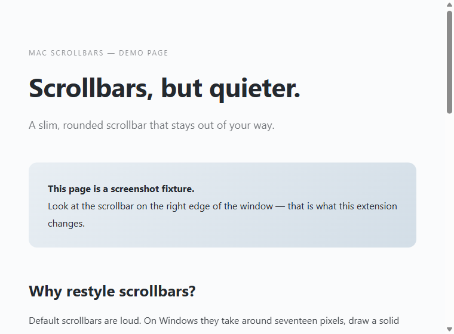
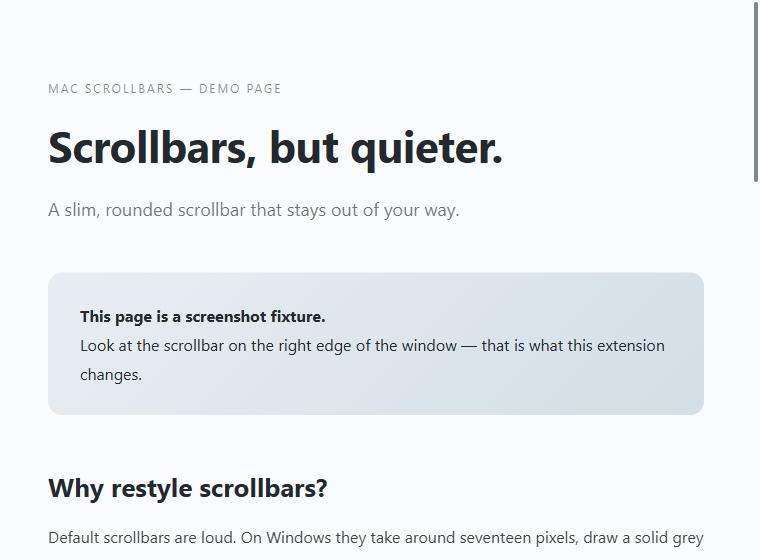
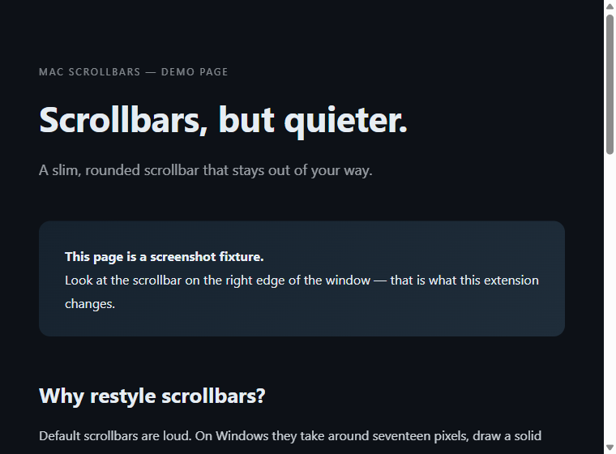
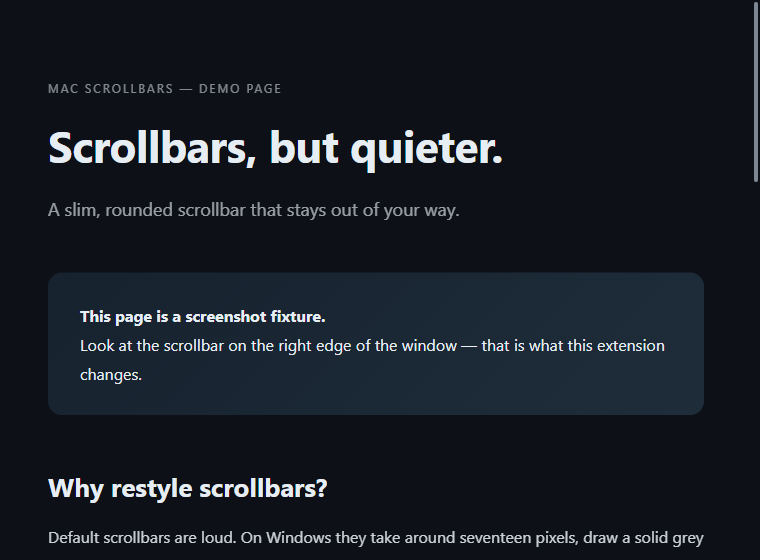
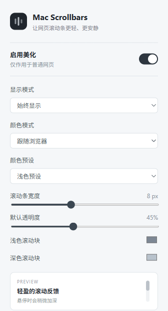

# Mac Scrollbars

**Slim, rounded, macOS-style scrollbars for Chrome and Edge.** One tiny extension, zero tracking — your scrollbars, but quieter.

> [!TIP]
> **Install in 30 seconds:** download the [latest release zip](https://github.com/FL411/mac-scrollbars/releases/latest), unzip it, then load the folder as an unpacked extension. Full steps below.

一个适用于 Edge 和 Chrome 的 Manifest V3 美化扩展，将普通网页的滚动条调整为接近 macOS 的细窄圆角样式。

当前支持：

- 始终显示或仅在滚动时显示
- 跟随浏览器颜色模式，或强制浅色/深色
- 浅色、深色两套内置颜色预设，同时支持分别自定义颜色
- 宽度和透明度自定义
- 针对当前网站单独停用
- 恢复默认设置，设置会同步保存
- 兼容使用标准 `scrollbar-width` / `scrollbar-color` 属性的网站（Chrome/Edge 121+），样式同样作用于页面内嵌 iframe

## 效果预览

**浅色主题**

| 原生滚动条 | Mac Scrollbars |
| :---: | :---: |
|  |  |

**深色主题**

| 原生滚动条 | Mac Scrollbars |
| :---: | :---: |
|  |  |

**设置面板**

对比图来自 [`docs/demo.html`](docs/demo.html)（静态占位页，可在浏览器中自行打开复现）。

## 加载方式

1. 打开 `edge://extensions` 或 `chrome://extensions`。
2. 开启“开发人员模式”。
3. 点击“加载解压缩的扩展”，选择本目录。
4. 打开任意普通网页，点击工具栏中的扩展图标调整设置。

修改扩展文件后，请在扩展管理页点击“重新加载”，再刷新已打开的网页。

扩展只会作用于普通网页，浏览器内部页面（例如 `chrome://`、`edge://`）受浏览器安全策略限制，无法注入样式。

已知限制：

- Shadow DOM 内部的滚动区域（部分 Web Components 应用）受浏览器样式隔离保护，纯 CSS 方案无法覆盖。
- 本地文件（`file://`）页面默认不注入，需在扩展详情页开启“允许访问文件网址”。

可用 `test/scrollbar-test.html` 验证修复效果（同样需开启文件网址权限）。
